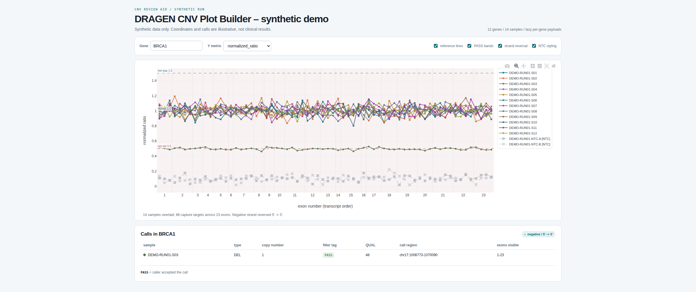
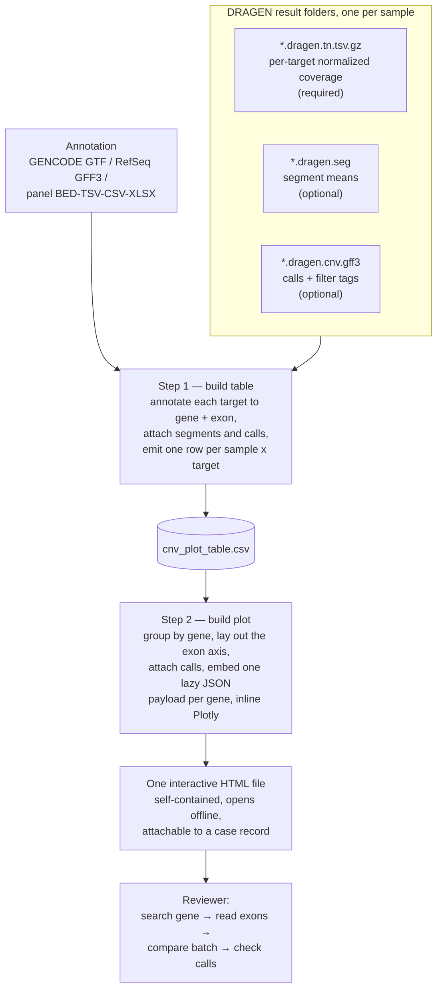
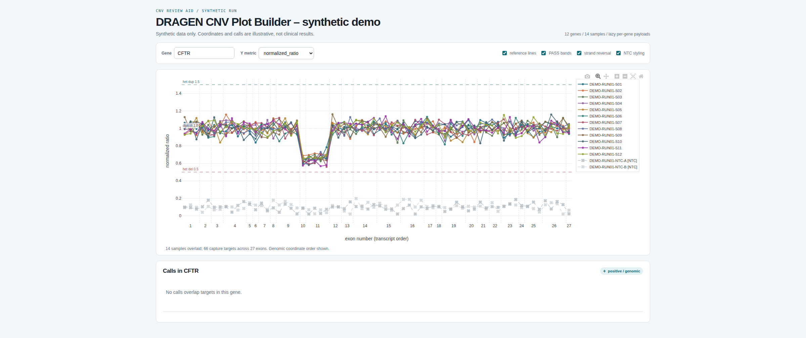

# DRAGEN CNV Plot Builder — Public Showcase

> **Synthetic showcase.** This repository contains no patient data, no clinical
> sample identifiers, no panel design files, and none of the production source
> code. Everything you can run here operates on data generated by
> `demo/generate_synthetic_run.py`, and the published page makes no network
> request of any kind.

A review aid for **exon-level copy-number variant (CNV) calls**. It turns DRAGEN
CNV exome output into a single interactive HTML plot, so a reviewer can open a
gene and judge whether a call is a **true CNV or an artifact** — without
installing Python, running a notebook, or opening a spreadsheet.

## Live demo

**[Open the synthetic CNV plot →](https://woongjaejung.github.io/dragen-cnv-plot-builder-showcase/)**

[](https://woongjaejung.github.io/dragen-cnv-plot-builder-showcase/demo/)

Twelve genes, fourteen synthetic samples including two no-template controls.
Search a gene, switch the y-axis metric, toggle a sample off in the legend, and
read the call table underneath. Six findings are planted in the data — see
[What the demo is showing you](#what-the-demo-is-showing-you).

## Why this exists

DRAGEN reports a CNV call with a copy number, a quality score, and a filter tag.
Deciding whether that call is real is a **judgement**, and the numbers alone do
not support it well: a segment-level call says *something changed here*, but not
whether the change is convincing.

What a reviewer actually needs to see, all at once:

- the **per-exon** normalized coverage inside the called region, not just the
  segment average — a call driven by one noisy capture target looks nothing like
  a clean shift across every exon of a gene
- the **same targets in the other samples of the batch**, because a dip shared by
  every sample is a capture or GC artifact of that target, not a deletion in one
  patient
- where the values sit relative to the **expected copy states** — diploid,
  heterozygous deletion, heterozygous duplication
- how the **no-template controls** behave at the same positions
- what the caller actually thought, **including the calls it filtered out**, and
  why

Getting that from raw DRAGEN outputs means joining a per-target coverage file, a
segment file, and a call file for every sample, then plotting them gene by gene.
Doing it by hand, per case, is slow and inconsistent. This tool does the join
once and hands over a single file the reviewer can open, search, and attach to a
case record.

## Who this is for

- **Clinical genomics reviewers and variant scientists** confirming or rejecting
  exon-level CNV calls before they reach a report
- **Molecular pathology and diagnostic lab staff** who need the evidence for a
  call in one view rather than across three files
- **NGS bioinformatics and field support engineers** triaging whether a
  suspicious call is biology or a capture/GC artifact of the panel
- **Panel and assay developers** looking at how a capture design behaves across a
  batch, target by target
- **Anyone distributing analysis tooling to non-technical users on locked-down
  clinical workstations** — the packaging problem here is as much the point as
  the plot

## How the plot supports the judgement

| Reviewer's question | What the plot gives |
|---|---|
| Is this shift real, or one bad target? | Every exon of the gene as its own point, with exon-boundary separators |
| Is it specific to this sample? | The whole batch overlaid on the same exon axis — a shared dip is visible instantly |
| Does the magnitude match a copy state? | Reference lines at 1.0 diploid, 0.5 het del, 1.5 het dup (log2 equivalents when that metric is selected) |
| Did the controls behave? | NTC samples auto-detected by regex, drawn muted with an X marker and a dashed line |
| What exactly was called here? | PASS regions shaded behind the points, plus a table of every overlapping call — PASS **and** filtered — with each filter tag explained |
| Which exons does the call cover? | Call rows list the exon numbers visible in the current plot |
| Am I reading the gene in the right direction? | Negative-strand genes drawn right-to-left so exons run 5'→3' |

Metrics switch between normalized ratio, tangent-normalized log2, and segment
mean. Filtered calls are **shown rather than hidden**, so a reviewer can see why
something was rejected instead of only trusting what passed.

## Flow



In production both steps sit behind a **portable Electron desktop app**: the
reviewer browses to a folder, the app scans it recursively for valid DRAGEN CNV
results, lists the samples it found, and runs the pipeline with a live log.
Distribution matters as much as the plot — reviewers work on Windows clinical
workstations where they cannot install a Python toolchain, so the app ships as a
single portable executable with a Python runtime bundled, and the generated HTML
inlines Plotly so it opens with no internet connection.

## What the demo is showing you

The synthetic batch has six findings planted in it, one per situation the plot
is designed to resolve:

| Gene | Sample | What it looks like | The point |
|---|---|---|---|
| **BRCA1** | S03 | Every exon at ~0.5, PASS DEL call across the gene | The textbook true CNV — a clean shift across the whole gene, in one sample only |
| **EGFR** | S07 | Exons 18–21 at ~1.5, PASS DUP call | A focal duplication that only reads as convincing because the flanking exons are flat |
| **PTEN** | S05 | One exon at ~0.45, everything else normal | A single noisy target. The call exists but is filtered `cnvLength` — this is why filtered calls are shown |
| **CFTR** | *all samples* | Exons 10–11 dip to ~0.65 in every sample | A capture/GC artifact of the panel, not a deletion. Only visible because the batch is overlaid |
| **DMD** | S09 | Exons 8–13 at ~0.5 on a negative-strand gene | Exercises the 5'→3' reversal — the plot reads in transcript order, not coordinate order |
| **TP53** | S02 | Exons 4–6 at ~0.55, call filtered `cnvQual` | A plausible-looking event the caller rejected. The reviewer gets to see it and disagree |

The two `NTC` samples sit near zero throughout, as no-template controls should.

The CFTR view is the one worth dwelling on:



Every sample drops at exons 10–11 and nothing was called. Looking at one sample
alone, that dip is a two-exon deletion. Looking at the batch, it is the capture
design. This is the comparison the plot exists to make, and it is the reason the
whole batch is drawn on one axis rather than one sample per page.

## What is in this repository

```
demo/
  generate_synthetic_run.py   synthesize DRAGEN-shaped sample folders + a panel file
  build_plot_table.py         step 1 — sample folders -> one long CSV table
  build_plot_html.py          step 2 — CSV -> interactive self-contained HTML
  plot_runtime.js             browser-side interactivity, inlined into the page
  run_demo.py                 runs all three, writes docs/demo/index.html
docs/
  index.html                  landing page (GitHub Pages)
  demo/index.html             the generated interactive plot
  vendor/plotly-2.35.2.min.js Plotly, vendored so the page loads nothing remote
assets/                       screenshots
```

Reproduce the demo from scratch:

```bash
python3 demo/run_demo.py     # Python 3.10+, standard library only
```

Same seed, byte-identical output. The demo pipeline is a **reduced
reimplementation written for this repository** — it reproduces the data layout,
the plot design, and the interaction model, at demo fidelity. The production
tool, its bundled annotation, and the Electron packaging are not published here.

---

## Engineering notes

Notes from building and maintaining the production tool. The measurements are
from real runs on synthetic and de-identified batches; none of it changes what
the plot shows. This is the part most worth reading.

### The batch-size ceiling

Reviewers started plotting larger batches, and a user reported that **19 samples
worked but 24 did not** — no error message, just a page that never rendered.

Step 2 had been embedding the entire dataset in one element and parsing it in a
single call:

```js
JSON.parse(document.getElementById('plot-data').textContent)
```

A JavaScript string cannot exceed V8's `String::kMaxLength` — **536,870,888
characters** (512 MiB) on 64-bit. The payload grew about **27.4 MB per exome
sample**, which puts the ceiling between 19 and 20:

| Samples | Payload | vs. limit | Result |
|--------:|--------:|---|---|
| 19 | ~521 MB | fits, barely | works |
| **20** | **542,713,946** | **5,843,058 over** | **fails** |
| 24 | ~658 MB | far over | fails |

Reproduced end to end: a real 20-sample page left the renderer permanently
unresponsive, which is exactly why nothing surfaced to the user as an error.
Python-side peak memory was a second wall, reaching 6.8 GB at 20 samples.

Three changes to the data layout removed the ceiling — hoisting per-target
metadata to one copy per gene instead of one copy per sample per target, storing
points column-wise instead of one object per point, and emitting one lazily
parsed `<script>` per gene so no single string ever holds everything:

| | Before | After |
|---|---:|---:|
| Payload, 4 samples | 109.7 MB | **28.6 MB** |
| Peak RSS, 4 samples | 1.61 GB | **175 MB** |
| 52 samples, largest single string | — | **776 KB** (0.14% of the limit) |
| 52 samples, page interactive | never | **1.1 s** |

The gating criterion was that **nothing plotted could change**: output is
bit-identical across all 7,768 gene groups and 653,911 points — coordinates, axis
ticks, call tables, and strand — verified by direct comparison.

The demo in this repository uses the same per-gene lazy-parse layout, and step 2
prints the largest embedded string next to the V8 limit on every run, because
that is the number to watch when adding samples.

### Runtime

A 30-sample run took 373 s, 92% of it in step 1. Every sample in a run comes from
the same panel, so a given `(contig, start, end)` target resolves to the same
annotation in all of them; caching by target key turned an
`O(samples × targets)` overlap search into `O(targets)`. **373 s → 134 s**, output
byte-identical.

The intermediate CSV was also 67% repeated absolute paths that step 2 never
reads. A `--slim` flag drops them, taking a 52-sample table from 5.03 GB to
1.63 GB.

### Load testing found what small batches hid

A synthetic-sample harness builds N sample folders from one real one, emitting
only the three files the pipeline reads — 30 samples cost 132 MB instead of
42 GB, with per-sample noise under a fixed seed so the traces stay
distinguishable.

That harness surfaced two defects invisible at small batch sizes: a legend that
collapsed into a single 30-row scrolling column, and **PASS bands drawn once per
call** — so a region called in 30 samples stacked 30 translucent rectangles into
a 99.5% opaque block, sitting directly over the very points it was meant to sit
behind. Both are fixed in the demo code here too.

## Known limitations

- **hg38 (GRCh38) only.** One annotation file per run. Mixing genome builds
  leaves the gene columns blank without raising an error, and those rows are then
  dropped from the HTML.
- **One capture panel per plot.** Mixing designs is accurate but hard to read —
  targets are keyed by exact coordinates, so a different design lands on
  different x positions and samples stop overlaying.
- GENCODE is Ensembl/ENST-based, so exon numbers can differ from RefSeq NM.
  Supply a RefSeq GFF3 or a panel-matched sheet when numbering has to match a
  panel document exactly.
- **This is a review aid, not a diagnostic device.** The calls remain the
  caller's; the plot only makes them easier to inspect.

## Data safety

- Every value in this repository is synthetic and generated by committed code
  from a fixed seed.
- Gene symbols are real; the coordinates attached to them are illustrative, not
  a real capture panel.
- No patient data, sample accession, run identifier, panel design, credential,
  token, or internal hostname appears anywhere in this repository or in the
  published page.
- The published page loads no third-party resource and makes no network request.
  Plotly is vendored locally.
- The production source, the bundled reference annotation, and the Windows
  packaging are not included here.

---

**Keywords:** DRAGEN · CNV · copy number variation · exon-level CNV review ·
clinical genomics · molecular diagnostics · NGS · whole exome sequencing ·
variant review · bioinformatics visualization · Plotly · interactive HTML report
· Electron · portable Windows application · offline reporting · GRCh38 / hg38
